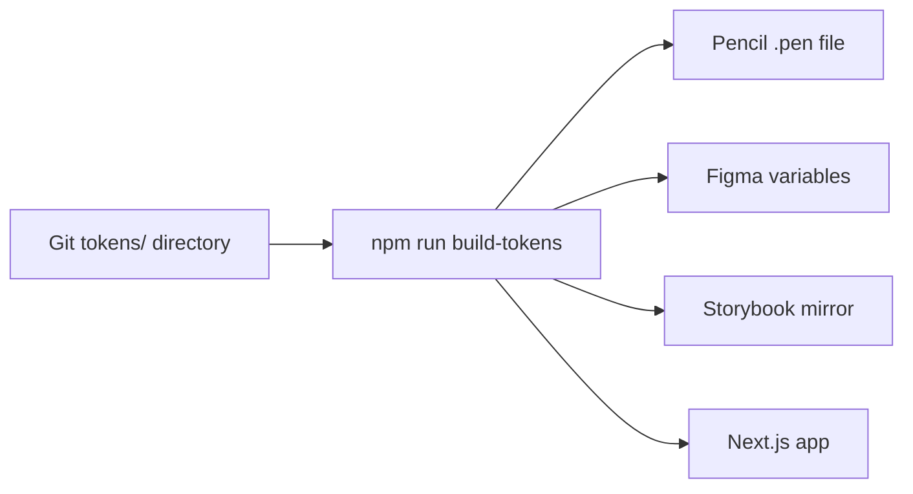

# Designer Workflow

A short, honest guide to how design, code, and docs now move together at Hearst.

---

## Welcome

Our workflow has one new rule: **Git is the single source of truth**. Everything else — Figma, Pencil, Storybook, the live app — reads from Git and stays in sync automatically.

Nothing you already do in Figma or Pencil disappears. You still sketch, compose, and prototype in the tools you love. The change is behind the scenes: instead of each tool holding its own copy of colors, fonts, and spacing, they now all pull from one shared list. When that list updates, every tool updates.

This means less hunting for the "right" hex, fewer handoff documents, and no more "which file is current?" — because the answer is always Git.

---

## The big picture




You edit a value in Git. One command rebuilds the tokens. Pencil, Figma, Storybook, and the live app all reflect the change.

---

## The tool box

Each tool has one job. Knowing which tool owns what keeps the system honest.

| Tool | Role | What you do here | Source of truth? |
|------|------|------------------|:---:|
| **Git** | The library | Edit token JSON, open PRs, review history | Yes |
| **Figma** | Sketchpad | Explore, ideate, share with stakeholders | No |
| **Pencil** | Precision template | Build production-grade component specs and handoff pages | No |
| **Storybook** | Mirror | Preview every component across all 29 brands in a real browser | No |

### Git — the library

Tokens live in [`hearst-design-system/tokens/`](hearst-design-system/tokens/). Three layers: `core/`, `semantic/`, `brands/`. You branch, edit values, and open a PR. That's it.

### Figma — the sketchpad

Figma receives tokens via `npm run push-figma`. Our design system variables show up as a collection with 29 brand modes. Use Figma for fast exploration — but if you want a change to "stick", it has to land in Git first.

### Pencil — the precision template

[`hearst-brands.pen`](hearst-brands.pen) is the single design file. It uses `$variable-name` references that resolve to live token values. Tokens are pushed here via `npm run push-pencil`. When you build a component spec in Pencil with `$brand-1` and `$space-md`, it automatically stays in sync with code.

### Storybook — the mirror

Deployed at `hearst-design-system.netlify.app/storybook`. This is where you verify a change actually works across Cosmopolitan, Car and Driver, Esquire, and every other brand. If it looks right in Storybook, it looks right in production.

---

## Token structure

Tokens are organized in three layers. You almost always touch only the **Brands** layer.

| Layer | Path | What lives here |
|-------|------|-----------------|
| **Core** | [`hearst-design-system/tokens/core/global.json`](hearst-design-system/tokens/core/global.json) | Shared primitives: spacing scale, font sizes, border radii, elevation, global colors |
| **Semantic** | [`hearst-design-system/tokens/semantic/aliases.json`](hearst-design-system/tokens/semantic/aliases.json) | Intent-based aliases like `background-brand` and `content-brand` that point at `$brand-1` |
| **Brands** | [`hearst-design-system/tokens/brands/{slug}.json`](hearst-design-system/tokens/brands/) | Per-brand values: `brand-1` through `brand-14`, palette colors, component colors, typography presets |
| **Meta** | [`hearst-design-system/tokens/brands/_meta.json`](hearst-design-system/tokens/brands/_meta.json) | Per-brand font overrides: `fontHeadline`, `fontHeadlineWeight`, `fontSecondary` |

### The one guardrail that matters

> **Edit values, never keys.** Change `"#d70000"` to `"#b80000"` — safe. Change `"brand-1"` to `"primary-red"` — breaks everything. If a token key needs to change, that's a developer task.

### Naming in a nutshell

- Kebab-case: `palette-brand-1`, `component-button-background-primary-solid-default`
- Spacing scale: `none, 3xs, 2xs, xs, sm, md, lg, xl, 2xl, 3xl, 4xl, 6xl`
- Font sizes: `font-size-4xs` through `font-size-15xl`, in `rem`

Full reference: [`HEARST-TOKEN-NAMING-TAXONOMY.md`](HEARST-TOKEN-NAMING-TAXONOMY.md).

---

## AI agents / skills

Seven specialist agents live in Cursor. Each one knows a specific part of the system. You call them by describing what you want — the right one activates automatically.

| Agent | Use when you're… |
|-------|------------------|
| [Token Architect](.cursor/skills/hearst-token-architect/SKILL.md) | Editing color, font, or spacing values; adding a brand |
| [Figma Sync](.cursor/skills/hearst-figma-sync/SKILL.md) | Pushing tokens to Figma or debugging variable drift |
| [Pencil Design](.cursor/skills/hearst-pencil-design/SKILL.md) | Building specs, annotations, or handoff pages in `.pen` files |
| [Frontend Component](.cursor/skills/hearst-frontend-component/SKILL.md) | Building or fixing a React component for the design system |
| [Storybook Docs](.cursor/skills/hearst-storybook-docs/SKILL.md) | Adding a story, MDX page, or configuring Storybook |
| [DevOps / Deploy](.cursor/skills/hearst-devops-deploy/SKILL.md) | Running Git commits, fixing CI, deploying to Netlify |
| [QA / Review](.cursor/skills/hearst-qa-review/SKILL.md) | Verifying a change across all 29 brands before shipping |

### Talking to agents

You don't memorize agent names. You describe the task:

- "Change Cosmopolitan's brand-1 to a softer red and verify across 3 brands" → Token Architect + QA
- "Push the latest tokens to Figma" → Figma Sync
- "Create a handoff page for the Card component in Pencil" → Pencil Design
- "Audit the NavBar for hardcoded colors" → Frontend Component + QA

---

## Your daily flow

The full path from idea to production. Run these from `hearst-design-system/`.

### 1. Branch

```bash
git checkout -b tokens/cosmopolitan-softer-red
```

Always work on a branch. Never commit directly to `main`.

### 2. Edit

Open the relevant file — for a brand color, that's `tokens/brands/{slug}.json`. Change only values.

Or ask Cursor: *"Change Cosmopolitan brand-1 to #b80000"* and let the Token Architect do it.

### 3. Build and check

```bash
npm run build-tokens
npm run tokens:check
```

`build-tokens` regenerates `src/lib/brands.ts` and `src/lib/tokens.css`. `tokens:check` catches accidental removals, naming drift, and invalid hex.

### 4. Preview

```bash
npm run dev
```

Open `http://localhost:3000` and use the brand switcher. Test at least three brands — include one you didn't touch, to confirm nothing leaked.

### 5. Commit and open a PR

```bash
git add -A
git commit -m "tokens(cosmopolitan): soften brand-1 red"
git push -u origin HEAD
```

Then open a PR on GitHub. A developer reviews and merges.

### 6. Automatic sync

Once merged, the team runs `npm run push-figma` and `npm run push-pencil`. Your change appears in Figma variables and in `hearst-brands.pen` without you doing anything else.

---

## Guardrails

A short list of "you can't break this if you follow these."

- **Never** edit `src/lib/brands.ts` or `src/lib/tokens.css` — they are generated.
- **Never** commit directly to `main`. Always branch.
- **Never** hardcode hex values in Pencil — use `$variable` references.
- **Always** run `npm run tokens:check` before committing.
- **Always** preview in the dev server across at least three brands.
- **Only** change token values, never token keys or structure. Key changes are a developer task.
- `.pen` files are encrypted — open them through Cursor's Pencil editor, not a text editor.

---

## Troubleshooting

| Symptom | Fix |
|---------|-----|
| Tokens look stale in the browser | `npm run build-tokens`, then restart the dev server |
| A brand is missing from the switcher | Run `npm run build-tokens` — new brands in `tokens/brands/` are auto-discovered |
| `push-figma` fails with a 413 error | Use the batched push: it splits the payload into 6 smaller batches |
| Storybook shows a blank page locally | `rm -rf node_modules/.cache/storybook node_modules/.vite-storybook && npm run storybook` |
| Storybook is blank in production | Confirm `scripts/fix-storybook-paths.mjs` ran during the Netlify build |
| `tokens:check` complains about a removed key | You probably renamed or deleted a key. Restore it — keys never change. |

For deeper technical context, see [`WORKFLOW.md`](WORKFLOW.md).

---

## Why this matters

- **Faster design-to-production cycles.** One source of truth removes the re-syncing step.
- **Consistent UI across platforms.** Figma, Pencil, Storybook, and the live app cannot drift — they all read from the same Git files.
- **Fewer handoffs, higher quality.** The handoff *is* the PR. Reviewers see the exact change, the exact brands affected, and the exact code that ships.

You are not learning a new tool. You are learning where your work already lives — and trusting that when it lands in Git, the rest of the system catches up automatically.
