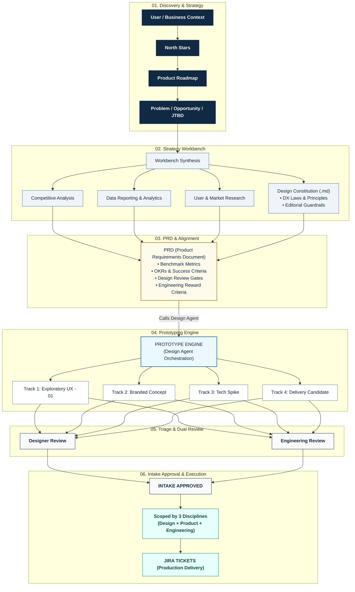
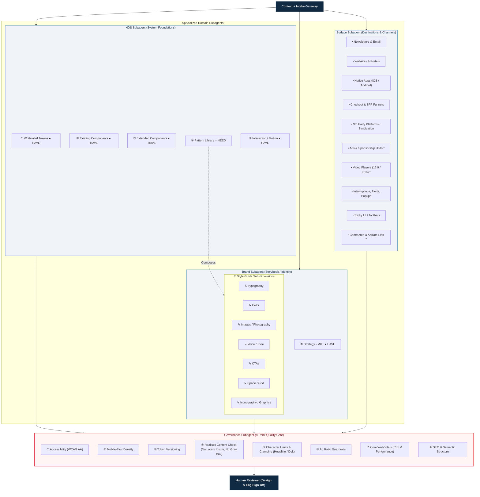
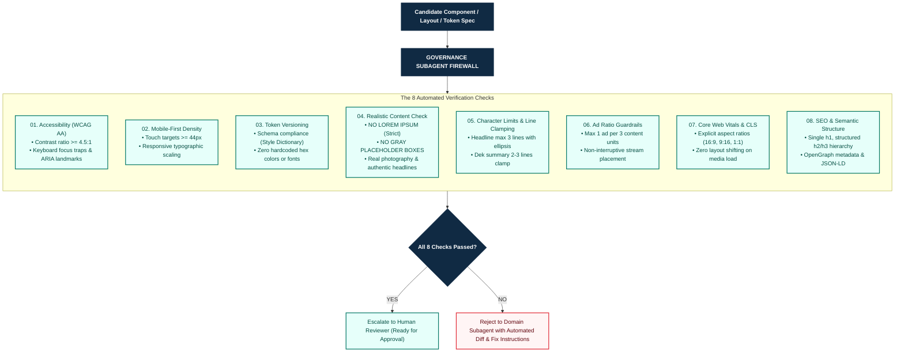
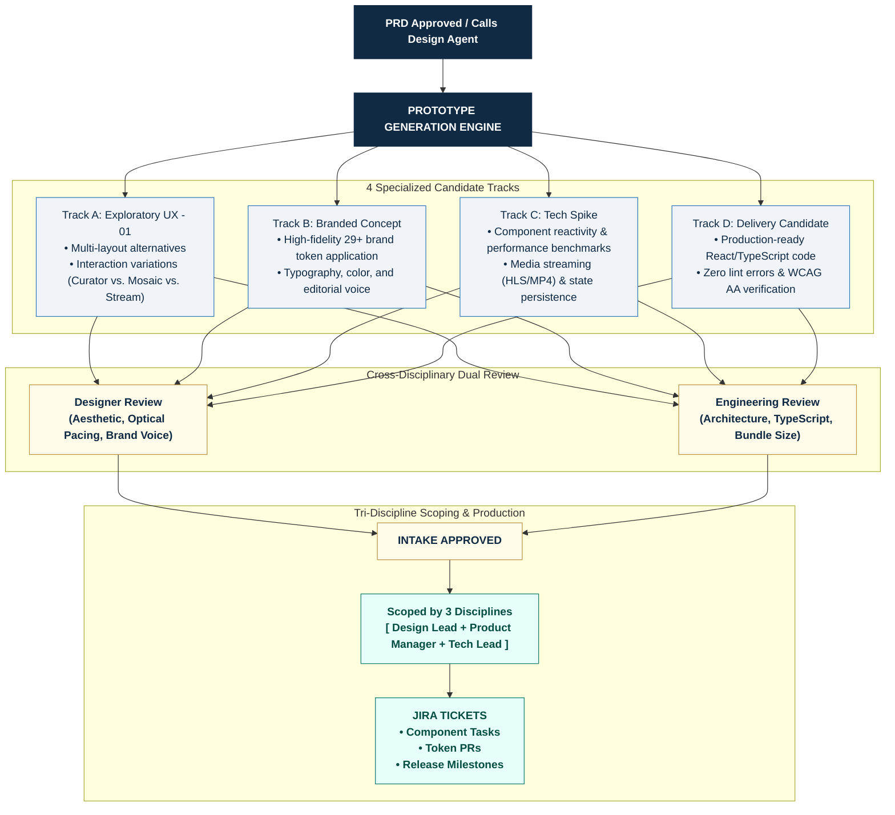

# HDS Design Agent System Architecture & Workflow

> **Transcribed & Synthesized from HDS Whiteboard Architecture**: Comprehensive breakdown of the 5 core system diagrams mapping the end-to-end product lifecycle, multi-subagent orchestration, FRE UI Kit foundations, 8-point governance firewall, and 4-track prototyping delivery model.

---

## Diagram 1: End-to-End Product Lifecycle & Intake Workflow

This diagram captures the macro flow from initial user/business needs down to production Jira tickets, highlighting how the **Design Constitution** guides the PRD and triggers the **Design Agent Prototype Engine**.

---

## Diagram 2: Multi-Agent Subagent Orchestration Architecture

This diagram details the internal orchestration of the **Design Agent**, fanning out from a centralized `Context + Intake` node into three specialized domain subagents (**HDS**, **Brand**, **Surface**), converging through the **Governance Subagent**, and escalating to the **Human Reviewer**.

---

## Diagram 3: FRE UI Kit & Editorial Modes Foundation

This diagram illustrates the underlying **FRE UI Kit** technical stack (ShadCN, Base UI, token reactivity, naming conventions, and Tailwind delivery) powering the HDS Subagent and driving the **Editorial Modes** across navigation and page archetypes.

```mermaid
flowchart LR
    classDef kitStyle fill:#102A43,stroke:#102A43,color:#ffffff,font-weight:bold;
    classDef stackStyle fill:#F0F4F8,stroke:#2D75B9,color:#102A43;
    classDef modeStyle fill:#FFFBEA,stroke:#B9913F,color:#102A43;
    classDef outputStyle fill:#E6FFFA,stroke:#087A68,color:#044E43;

    subgraph FRE_KIT ["FRE UI KIT (Core Infrastructure)"]
        K1["ShadCN Base Primitives"]
        K2["Base UI FX & Interactivity"]
        K3["Token Reactivity (Style Dictionary)"]
        K4["Strict Naming Conventions & Opinions"]
        K5["Component Library Authority"]
        K6["Tailwind Delivery System"]
    end

    subgraph EDITORIAL_MODES ["Editorial Modes & Archetype Rules"]
        direction TB
        subgraph NAV_MODES ["Global Navigation Modes"]
            N1["• Slim Mode (Utility-focused)"]
            N2["• Search-Heavy Mode (Discovery)"]
            N3["• Standard Mode (Brand + Categories)"]
            N4["• Mega Menu Mode (Full Network)"]
        end

        subgraph PAGE_MODES ["Homepage & Header Modes"]
            P1["• Newsy / Dense Mode (Rapid Scanning)"]
            P2["• Photo-Heavy / Immersive Mode (Visual Mosaic)"]
            P3["• Product-Heavy / Utility Mode (Commerce & Lab Tests)"]
        end
    end

    subgraph HDS_OUTPUT ["HDS Subagent Outputs"]
        O1["Whitelabel Tokens ● HAVE"]
        O2["Existing Components ● HAVE"]
        O3["Extended Components ● HAVE"]
        O4["Pattern Library ○ NEED"]
        O5["Interaction / Motion ● HAVE"]
    end

    FRE_KIT --> EDITORIAL_MODES
    EDITORIAL_MODES --> HDS_OUTPUT

    class FRE_KIT kitStyle;
    class K1,K2,K3,K4,K5,K6 stackStyle;
    class NAV_MODES,PAGE_MODES,N1,N2,N3,N4,P1,P2,P3 modeStyle;
    class HDS_OUTPUT,O1,O2,O3,O4,O5 outputStyle;
```

---

## Diagram 4: Governance Subagent 8-Point Compliance Firewall

This diagram breaks down the 8 automated checks enforced by the **Governance Subagent** before any design or code artifact can be presented to the human reviewer.

---

## Diagram 5: 4-Track Prototyping, Triage & Execution Model

This diagram illustrates how the Design Agent's prototype output is triaged into 4 distinct candidate tracks, reviewed by cross-functional disciplines, and translated into production-ready Jira tickets.

---

## Summary Capability Matrix (Whiteboard Status Legend)

| Subsystem | Capability Area | Status on Whiteboard | Implementation Path |
| :--- | :--- | :--- | :--- |
| **HDS Subagent** | Whitelabel Tokens | **● HAVE** | Style Dictionary `tokens/` JSON sets |
| **HDS Subagent** | Existing Components | **● HAVE** | `src/components/ui/` & Radix primitives |
| **HDS Subagent** | Extended Components | **● HAVE** | `src/components/hearst-plus/` modules |
| **HDS Subagent** | Pattern Library | **○ NEED** | Formal HDS Pattern Library & Composition Guidelines |
| **HDS Subagent** | Interaction / Motion | **● HAVE** | Embla transitions, CSS custom properties, dialog focus traps |
| **Brand Subagent** | Strategy - MKT | **● HAVE** | Brand value props & publication personas |
| **Brand Subagent** | Style Guide (7 sub-dimensions) | **● HAVE** | Typography, Color, Photography, Voice, CTAs, Space, Graphics |
| **Surface Subagent** | 10 Distribution Surfaces | **● HAVE / IN PROGRESS** | Web, Mobile, Video (16:9/9:16), Commerce, Newsletters |
| **Governance Subagent** | 8-Point Compliance Gate | **● HAVE** | TypeScript, ESLint, WCAG AA, No Lorem Ipsum, CLS checks |
| **Prototyping** | 4-Track Output Model | **● HAVE** | Exploratory UX, Branded Concept, Tech Spike, Delivery Candidate |
